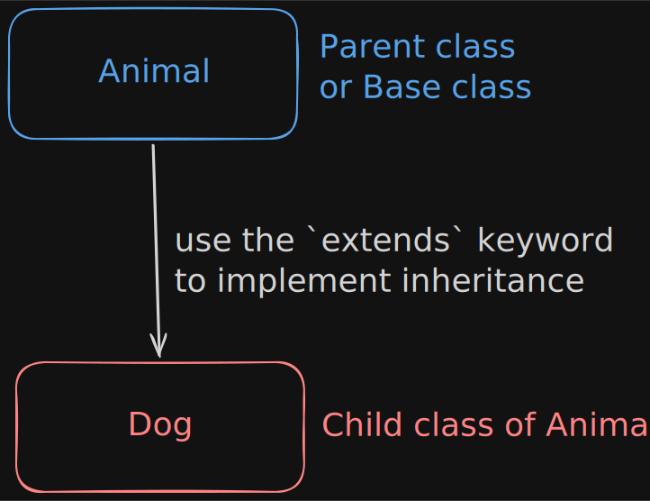

Inheritance is one of the 4 pillars of object oriented programming. Using the concept of inheritance,
a child class can inherit the properties and behaviour of a parent class(base class).

---



```java
public class Animal {
    int age;
    String name;
    public void eat() {
        System.out.println("The animal is eating....");
    }
}

// Here Dog is the child class and Animal is the parent class.
public class Dog extends Animal {
    public void bark() {
        System.out.println("Dog in barking...");
    }
}

```

:::note
In the above example:

`Dog`(child) and `Animal`(parent) are classes

`age` and `name` are properties of the `Animal` class

`eat` is a method of the `Animal` class

`bark` is a method of the `Dog` class
:::

## 1. Method Overriding

When a child class(subclass) provides its own implementation of a method that already exists inside the parent class(superclass), that is called as **Method Overriding**. This is called **_runtime polymorphism_** — the JVM decides at runtime (not compile time) which version to run.

:::caution
Always write `@Override` annotation above the method. It's technically optional, but it forces the compiler to catch your mistakes. Think of it as a safety net.
:::

```java

class Animal {
    void sound() {
        System.out.println("Animal makes a sound");
    }
}

class Dog extends Animal {
    @Override
    void sound() {
        System.out.println("Dog is barking");
    }
}

```

## 2. `super` keyword

`super` is a reference variable that always points to the **immediate parent class** of the current object.
It is used to call the parent's constructor, access its fields, or invoke its methods, even when the
child has overridden them.

### **Use 1:** `super()` to call the parent constructor

```java title="Computer.java"
class Computer {
    String brand;
    Computer(String b) {
        brand = b;
    }
}
```

```java title="Laptop.java"
class Laptop extends Computer {
    String model;
    Laptop(String b, String m) {
        super(b); // Here the parent constructor has been called.
        model = m;
    }
}
```

:::danger
`super()` must be the very first statement in the constructor — otherwise the compiler throws an error. If you don't write it explicitly, Java inserts super() (no-args) automatically. If the parent has no no-arg constructor, you must call the right one manually.
:::

### **Use 2**: `super.field` to access a parent field

This is used when the child has a field having the same name as the parent's field (this is called field hiding).
Without `super` we would only be able to see the child's version.

```java
class Animal {
    String color = "White";
}
```

```java
class Cat extends Animal {
    String color = "Black";
    void printColors() {
        System.out.println(color); // -> "Black"
        System.out.println(super.color); // -> "White"
    }
}
```

### **Use 3**: `super.method()` to call a parent method

This is the most important use of `super`. It can be used for calling a parent's overridden method so you can extend its behavior rather than completely replace it.

```java
class Animal {
    void sound() {
        System.out.println("Animal is making a sound.");
    }
}
```

```java
class Cat extends Animal {
    @Override
    void sound() {
        super.sound();
        System.out.println("Cat is meowing...");
    }
}
```

Output

```java
Animal is making a sound.
Cat is meowing...
```

## Types of inheritance in java

Java has 5 types of inheritance. We will discuss each one by one.

### 1. Single Inheritance

This is the simplest type of inheritance. There is one parent and one child.

```java
class A {}
class B extends A {}
```

### 2. Multilevel Inheritance

There are multiple levels at which inheritance works here. Just like, grandparent -> parent -> child relation.
Each level inherits everything from all the levels above it.

```java
class A {}
class B extends A {}
class C extends B {}
```

### 3. Hierarchial Inheritance

One parent, multiple children. All children independently inherit from the same parent, but they don't know about each other.

```java
class A {}
class B extends A {}
class C extends A {}
class D extends A {}
```

### 4. Multiple Inheritance

:::caution
Java **does not** support multiple inheritance through classes.
But it fully supports it through [interfaces](/my-personal-docs/oop/interface/).
:::

A class inheriting from more than one parents.
E.g. class `Eagle` inherits from both `Animal` and `Bird` classes.

### 5. Hybrid Inheritance

A combination of two or more types of inheritance in the same program. For example: multilevel (class extends class) + multiple (class implements interfaces). Java allows this cleanly because interfaces prevent ambiguity.
